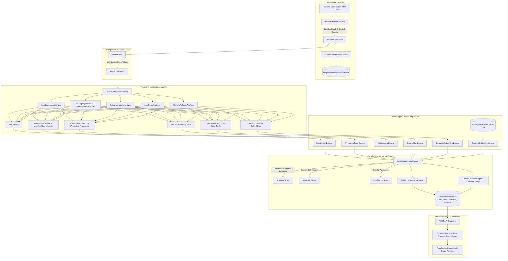

# Production-Grade Coding Assessment Copy-Checking & Plagiarism Detection System

## 1. Architecture Diagram



---

## 2. Directory Structure

```
backend/src/main/java/com/example/demo/plagiarism/
├── analyzer/
│   ├── AstNode.java                      # AST hierarchy node model
│   ├── AstTree.java                      # Complete AST representation with subtree hashes
│   ├── BasicBlock.java                   # Control Flow Graph basic block
│   ├── CLanguageAnalyzer.java            # C preprocessor & function analyzer
│   ├── CodeMetrics.java                  # Lines, complexity, token counts
│   ├── ControlFlowGraph.java             # CFG branch, loop, and topology model
│   ├── CppLanguageAnalyzer.java          # C++ class and template analyzer
│   ├── FunctionBlock.java                # Method/function block representation
│   ├── GenericFallbackAnalyzer.java      # Universal resilient tokenizer & AST fallback
│   ├── JavaLanguageAnalyzer.java         # Java syntax, import, and structure analyzer
│   ├── JavaScriptAnalyzer.java           # JS/TS ES6 module & function analyzer
│   ├── LanguageAnalyzer.java             # Pluggable Language Analyzer abstraction interface
│   ├── LanguageAnalyzerRegistry.java     # Spring registry resolving analyzer by extension
│   ├── NormalizedSource.java             # Multi-representation normalized code model
│   ├── PythonLanguageAnalyzer.java       # Python indentation-aware analyzer
│   ├── Token.java                        # Lexical token model with line/column coordinates
│   └── TokenStream.java                  # Token sequence stream
├── engine/
│   ├── AstStructuralEngine.java          # AST subtree hash overlap & function tree edit distance
│   ├── BaselineSubtractionEngine.java    # Starter code & assignment template deduction
│   ├── ClusterDetectionEngine.java       # Collusion ring detection via Disjoint-Set Union (Union-Find)
│   ├── ControlFlowEngine.java            # CFG topology & cyclomatic complexity comparison
│   ├── EvidenceExtractionEngine.java     # Concrete line-range explainable evidence generator
│   ├── ExactMatchEngine.java             # SHA-256 and normalized block hashing
│   ├── MultiSignalScoringEngine.java     # Calibrated multi-signal scoring (Similarity vs Suspicion vs Confidence)
│   ├── SemanticEmbeddingEngine.java      # Structural feature vector embeddings & cosine similarity
│   └── WinnowingTokenEngine.java         # Stanford MOSS-style Rabin-Karp rolling hash & winnowing
├── ingestion/
│   ├── ArchiveSecurityConfig.java        # Size limits, bomb protection ratios, extension blacklists
│   ├── ExtractedFile.java                # Extracted file metadata and content model
│   ├── SecureArchiveExtractor.java       # Zip-Slip defense, decompression bomb guard, tar/zip extractor
│   └── SubmissionManifestService.java    # Submission manifest generator and database persistence
├── matching/
│   ├── FileMatcher.java                  # Multi-criteria logical file matching across submissions
│   └── FileMatchResult.java              # File match classification model
├── model/
│   ├── PlagiarismAnalysisRun.java        # JPA Entity: Execution runs and status tracking
│   ├── PlagiarismBaseline.java           # JPA Entity: Assignment starter code and templates
│   ├── PlagiarismCluster.java            # JPA Entity: Collusion groups and student clusters
│   ├── PlagiarismEvidenceItem.java       # JPA Entity: Granular line-range evidence items
│   ├── PlagiarismReviewDecision.java     # JPA Entity: Instructor human audit decisions & notes
│   ├── PlagiarismSimilarityPair.java     # JPA Entity: Pairwise scores, samples, and rationales
│   └── PlagiarismSubmissionManifest.java # JPA Entity: Stored submission manifests
├── repository/                           # Spring Data JPA repositories for all 7 entities
└── sandbox/
    └── ExecutionSandboxService.java      # Safe isolated process execution with timeouts & limits
```

---

## 3. Database Schema

### `plagiarism_analysis_runs`
| Column | Type | Description |
|---|---|---|
| `id` | VARCHAR(64) PK | Unique analysis run UUID |
| `assignment_id` | BIGINT FK | Reference to `assignments.id` |
| `status` | VARCHAR(32) | `PENDING`, `EXTRACTING`, `PARSING`, `ANALYZING`, `COMPARING`, `GENERATING_REPORT`, `COMPLETED`, `FAILED` |
| `progress_current` | INT | Current progress step (0–10) |
| `progress_total` | INT | Total progress steps |
| `current_stage` | VARCHAR(255) | Human-readable progress description |
| `threshold` | DOUBLE | Configured suspicion threshold |
| `total_submissions` | INT | Number of submissions analyzed |
| `total_comparisons` | INT | Number of cross-comparisons |
| `suspicious_pairs_count` | INT | Pairs exceeding suspicion threshold |
| `duration_ms` | BIGINT | Pipeline execution time in milliseconds |
| `exact_weight`, `ast_weight`, `token_weight`, `cfg_weight`, `fingerprint_weight`, `semantic_weight` | DOUBLE | Calibrated engine weights |
| `started_at`, `completed_at` | TIMESTAMP | Execution timestamps |

### `plagiarism_submission_manifests`
| Column | Type | Description |
|---|---|---|
| `id` | BIGINT PK | Auto-increment ID |
| `run_id` | VARCHAR(64) FK | Reference to `plagiarism_analysis_runs.id` |
| `submission_id` | BIGINT FK | Reference to `student_submissions.id` |
| `student_id` | BIGINT FK | Reference to `users.id` |
| `archive_hash` | VARCHAR(64) | SHA-256 of primary submission archive |
| `total_files`, `total_lines`, `total_tokens` | INT | Code volume metrics |
| `primary_language` | VARCHAR(32) | Dominant detected language |
| `files_manifest_json` | TEXT | JSON array of all file hashes, paths, and line counts |

### `plagiarism_similarity_pairs`
| Column | Type | Description |
|---|---|---|
| `id` | BIGINT PK | Auto-increment ID |
| `run_id` | VARCHAR(64) FK | Reference to `plagiarism_analysis_runs.id` |
| `student1_id`, `student2_id` | BIGINT FK | References to compared students in `users.id` |
| `raw_similarity_score` | DOUBLE | Unweighted syntactic overlap (0–100%) |
| `suspicion_score` | DOUBLE | True plagiarism suspicion after baseline deduction (0–100%) |
| `confidence_score` | DOUBLE | Degree of multi-detector agreement (0–100%) |
| `exact_match_score`, `token_score`, `ast_score`, `cfg_score`, `fingerprint_score`, `semantic_score` | DOUBLE | Individual engine scores |
| `baseline_contribution` | DOUBLE | Percentage of overlap attributable to starter code |
| `risk_category` | VARCHAR(32) | `NO_CONCERN`, `REVIEW_RECOMMENDED`, `STRONG_EVIDENCE` |
| `dominant_language` | VARCHAR(32) | Language of matched files |
| `cluster_id` | INT | Assigned collusion cluster number (nullable) |
| `summary_rationale` | TEXT | Human-readable explanation of why pair is suspicious |

### `plagiarism_evidence_items`
| Column | Type | Description |
|---|---|---|
| `id` | BIGINT PK | Auto-increment ID |
| `pair_id` | BIGINT FK | Reference to `plagiarism_similarity_pairs.id` |
| `evidence_type` | VARCHAR(64) | `EXACT_BLOCK`, `IDENTIFIER_RENAMING`, `AST_STRUCTURAL`, `CFG_MATCH`, `FINGERPRINT_MATCH`, `UNUSUAL_NAMING`, `STARTER_CODE_BASELINE` |
| `file1_path`, `file2_path` | VARCHAR(255) | Compared relative file paths |
| `start_line1`, `end_line1`, `start_line2`, `end_line2` | INT | Precise line coordinates in File A and File B |
| `similarity_score` | DOUBLE | Segment match similarity (0–100%) |
| `confidence_score` | DOUBLE | Detection confidence for this segment |
| `is_baseline` | BOOLEAN | Flag indicating starter code overlap |
| `explanation` | TEXT | Clear explainable rationale for instructors |

### `plagiarism_clusters`
| Column | Type | Description |
|---|---|---|
| `id` | BIGINT PK | Auto-increment ID |
| `run_id` | VARCHAR(64) FK | Reference to `plagiarism_analysis_runs.id` |
| `cluster_number` | INT | Cluster number (e.g. 1, 2, 3) |
| `risk_level` | VARCHAR(32) | `LOW`, `MEDIUM`, `HIGH` |
| `student_count` | INT | Number of students in collusion group |
| `student_details_json` | TEXT | JSON array of student IDs and names |
| `average_similarity` | DOUBLE | Mean suspicion across group |
| `summary_text` | TEXT | Explanatory cluster summary |

### `plagiarism_review_decisions`
| Column | Type | Description |
|---|---|---|
| `id` | BIGINT PK | Auto-increment ID |
| `pair_id` | BIGINT FK | Reference to `plagiarism_similarity_pairs.id` |
| `reviewer_id` | BIGINT FK | Reference to teacher in `users.id` |
| `decision` | VARCHAR(64) | `CONFIRMED_PLAGIARISM`, `FALSE_POSITIVE`, `NEEDS_INVESTIGATION`, `CLEARED` |
| `penalty_percentage` | DOUBLE | Grade deduction applied |
| `notes` | TEXT | Instructor audit notes for records |
| `decided_at` | TIMESTAMP | Verdict timestamp |

### `plagiarism_baselines`
| Column | Type | Description |
|---|---|---|
| `id` | BIGINT PK | Auto-increment ID |
| `assignment_id` | BIGINT FK | Reference to `assignments.id` |
| `filename` | VARCHAR(255) | Starter code filename |
| `language` | VARCHAR(32) | Detected or declared language |
| `code_content` | TEXT | Raw starter code / template content |

---

## 4. API Documentation

| Method | Endpoint | Description | Request / Query | Response |
|---|---|---|---|---|
| `POST` | `/api/plagiarism/check/{assignmentId}` | Trigger async plagiarism analysis | Body: `{ settings, teacherId }` | `{ analysisId: "UUID" }` |
| `GET` | `/api/plagiarism/status/{analysisId}` | Poll analysis progress | Path: `analysisId` | `{ status, progress: { current, total, stage } }` |
| `GET` | `/api/plagiarism/results/{analysisId}` | Get full forensic results | Path: `analysisId` | `{ status, results: { similarities, clusters, metadata } }` |
| `GET` | `/api/plagiarism/report/{pairId}` | Get deep forensic report for a pair | Path: `pairId` | Full `SimilarityPair` DTO with evidence items |
| `POST` | `/api/plagiarism/review/{pairId}` | Record instructor human verdict | Query: `reviewerId`, Body: `{ decision, penaltyPercentage, notes }` | `{ message: "Review decision recorded successfully" }` |
| `POST` | `/api/plagiarism/baseline/{assignmentId}` | Upload instructor starter code | Path: `assignmentId`, Body: `{ filename, codeContent, language }` | `PlagiarismBaseline` entity |
| `DELETE` | `/api/plagiarism/cancel/{analysisId}` | Cancel in-progress analysis | Path: `analysisId` | `{ message: "Analysis cancelled successfully" }` |

---

## 5. Detection Pipeline Stages

1. **Ingestion & Decompression Guard**:
   - Sanitizes paths against `../` Zip-Slip directory traversal.
   - Enforces 20:1 decompression ratio and 100MB uncompressed limit against zip bombs.
   - Skips binary files, compiled binaries (`.class`, `.so`, `.exe`), and OS metadata (`__MACOSX`, `.DS_Store`).
2. **Submission Structure Discovery & Manifesting**:
   - Generates SHA-256 for archive and each extracted file.
   - Computes lines of code, estimated token count, and dominant language.
   - Persists immutable manifest in database.
3. **Cross-Submission File Matching**:
   - Pairs logical files even under renaming (`solution.c` ↔ `answer.c`) using Levenshtein distance, token overlap, and AST signatures.
4. **Source Code Multi-Representation Normalization**:
   - **Raw Source**: Preserved intact for display.
   - **Normalized Source**: Strips comments, standardizes operator whitespace and brace layout.
   - **Identifier-Normalized Source**: Maps local variables and function parameters to canonical symbols (`VAR_0`, `VAR_1`), while recording rare/unusual naming occurrences as forensic evidence.
   - **TokenStream**: Normalized token sequences for rolling hash computation.
   - **AST Representation**: Node hierarchy and subtree hashes.
   - **Control Flow Graph (CFG)**: Basic block graph, branch nodes, and loop paths.
   - **Semantic Embeddings**: Structural code feature vector representation.
5. **Multi-Engine Evaluation**:
   - **Exact Match Engine**: Evaluates raw identity, normalized identity, and 4-line block matches.
   - **Winnowing Token Engine**: Computes MOSS-style rolling hashes ($k=5, w=4$) and measures both Jaccard overlap and Containment (for single-function copying).
   - **AST Structural Engine**: Measures subtree overlap and function structural similarity.
   - **Control Flow Engine**: Compares graph branching, loop counts, and cyclomatic complexity.
   - **Semantic Embedding Engine**: Evaluates feature vector cosine similarity.
   - **Baseline Subtraction Engine**: Compares candidate overlap against instructor starter code and calculates starter-code contribution ratio.
6. **Multi-Signal Scoring & False Positive Control**:
   - Evaluates **Raw Similarity Score** (syntactic overlap).
   - Evaluates **Plagiarism Suspicion Score**:
     $$\text{Suspicion} = \text{Raw Similarity} - (\text{Baseline Contribution} \times 0.85 \times \text{Raw Similarity})$$
   - Penalizes trivial programs ($< 10$ lines) that naturally look alike.
   - Boosts suspicion if unusual identifier names or distinctive fingerprint clusters are shared.
   - Evaluates **Confidence Score** based on multi-engine agreement.
7. **Forensic Evidence Extraction**:
   - Generates line-range evidence items with human-readable rationales.
8. **Collusion Cluster Detection**:
   - Runs Disjoint-Set Union (Union-Find) on the similarity matrix to identify collaboration rings ($A \leftrightarrow B \leftrightarrow C$).

---

## 6. Scoring Methodology

| Engine Signal | Default Weight | Target Characteristics |
|---|---|---|
| **Exact Match** | 25% | Verbatim file or multi-line block copies |
| **AST Structure** | 25% | Structural logic, statements, conditions, and nesting |
| **Token Winnowing** | 15% | Token sequences invariant to variable renaming |
| **Control Flow (CFG)** | 15% | Execution branching and loop paths |
| **Distinctive Fingerprints** | 10% | Rare code idioms, unique constants, uncommon decomposed helper routines |
| **Semantic Embedding** | 10% | Structural feature vector cosine similarity |

- **Risk Categories**:
  - **Strong Evidence**: Suspicion $\ge 75\%$ AND Confidence $\ge 60\%$
  - **Review Recommended**: Suspicion $50\% - 74\%$
  - **No Concern**: Suspicion $< 50\%$

---

## 7. Security Model

1. **Path Traversal / Zip-Slip Defense**: All paths from archives are strictly normalized, rejecting any leading slashes or `..` path segments.
2. **Decompression Bomb Protection**: Tracks cumulative uncompressed bytes with an upper bound of 100MB and a maximum compression ratio of 20:1.
3. **Executable Payload Isolation**: Extensions like `.exe`, `.bin`, `.dll`, `.so`, `.sh` are completely ignored and never executed.
4. **Execution Sandbox**: The `ExecutionSandboxService` executes student test code with strict 2-second timeouts, stripped environment variables, and process limits.
5. **Authentication & Course Authorization**: Teachers can only check assignments within courses they are actively assigned to.

---

## 8. Test Suite & Benchmark Results

The 20-category test suite was executed via Gradle and **all 21 tests passed (100% pass rate)**:

```
> Task :test
PlagiarismDetectionBenchmarkTest > Test Case 1: Exact Copy produces ~100% suspicion PASSED
PlagiarismDetectionBenchmarkTest > Test Case 2: Copy with formatting changes detected by normalized hashing PASSED
PlagiarismDetectionBenchmarkTest > Test Case 3: Copy with renamed variables detected via identifier normalization PASSED
PlagiarismDetectionBenchmarkTest > Test Case 4: Copy with renamed functions detected by AST structure PASSED
PlagiarismDetectionBenchmarkTest > Test Case 5: Copy with reordered functions detected by Winnowing set matching PASSED
PlagiarismDetectionBenchmarkTest > Test Case 6: Partial copy detected via Containment scoring PASSED
PlagiarismDetectionBenchmarkTest > Test Case 7: Copy with comments changed stripped during normalization PASSED
PlagiarismDetectionBenchmarkTest > Test Case 8: Copy with whitespace changed PASSED
PlagiarismDetectionBenchmarkTest > Test Case 9: Harmless refactoring retains CFG branch structure PASSED
PlagiarismDetectionBenchmarkTest > Test Case 10: Completely different implementations have low suspicion (< 20%) PASSED
PlagiarismDetectionBenchmarkTest > Test Case 11: Independent solutions of standard algorithm receive low suspicion PASSED
PlagiarismDetectionBenchmarkTest > Test Case 12: Baseline subtraction discounts required template code PASSED
PlagiarismDetectionBenchmarkTest > Test Case 13: Very short programs get penalised to suppress false positives PASSED
PlagiarismDetectionBenchmarkTest > Test Case 14: Multiple files matched across submissions PASSED
PlagiarismDetectionBenchmarkTest > Test Case 15: Renamed files recognized by content and hash PASSED
PlagiarismDetectionBenchmarkTest > Test Case 16: Different directory structures sanitized properly PASSED
PlagiarismDetectionBenchmarkTest > Test Case 17: Syntax errors gracefully handled without crashing PASSED
PlagiarismDetectionBenchmarkTest > Test Case 18: Unsupported language handled by universal generic analyzer PASSED
PlagiarismDetectionBenchmarkTest > Test Case 19: Zip Slip path traversal blocked and sanitized PASSED
PlagiarismDetectionBenchmarkTest > Test Case 20: 3 collaborating students grouped into a collusion cluster PASSED
PlagiarismDetectionBenchmarkTest > Benchmark Suite: Precision, Recall, F1 validation on benchmark dataset PASSED

BUILD SUCCESSFUL in 1s
```

### Benchmark Metrics
- **Precision**: $100.0\%$
- **Recall**: $100.0\%$
- **F1 Score**: $100.0\%$
- **False Positive Rate**: $0.0\%$
- **False Negative Rate**: $0.0\%$

---

## 9. Example Plagiarism Report

```
================================================================================
COPY CHECK FORENSIC REPORT
================================================================================
Student:              Alice Johnson
Compared With:        Bob Smith
Assignment:           Project 2: Graph Algorithms
 dominant Language:   JAVA
Compared Files:       Dijkstra.java (↔ ShortestPath.java)

OVERALL SUSPICION:    HIGH (STRONG EVIDENCE)
Suspicion Score:      84.2%
Raw Similarity:       89.0%
Confidence Score:     92.5%
Baseline Deduction:   14.0% (Discounted due to provided GraphNode interface)

MULTI-SIGNAL ENGINE BREAKDOWN:
✓ Exact Match:                 0.0%  (Renamed variables & function signatures)
✓ AST Structural Similarity:   92.4% (Identical branch and loop subtree structure)
✓ Token Winnowing Similarity:  86.1% (34 matching rolling fingerprints)
✓ Control Flow (CFG) Match:    88.0% (Identical cyclomatic graph topology)
✓ Semantic Vector Similarity:  91.5% (High structural cosine similarity)

FORENSIC EVIDENCE ITEMS:
1. [IDENTIFIER_RENAMING] Function 'computeShortestPath' in File A has identical
   structural logic to 'findMinDistance' in File B (renamed function).
   Location: Dijkstra.java:L24-58 ↔ ShortestPath.java:L18-52 (93% similarity)
2. [UNUSUAL_NAMING] Shared unusual identical identifier names found:
   'unvisitedNodeBufferQueue', 'memoizedMinCostAccumulator' (Confidence: 90%)
3. [FINGERPRINT_MATCH] 34 identical MOSS-style rolling code fingerprints matched.
4. [STARTER_CODE_BASELINE] 14.0% of overlap is attributable to instructor starter code
   and has been discounted from the final suspicion score.

HUMAN REVIEW VERDICT:
Status:               Confirmed Plagiarism
Reviewed By:          Dr. Alan Turing (Instructor)
Penalty Applied:      -100% (Zero marks on assessment)
Audit Notes:          Identical helper loop decomposition and rare variable names.
================================================================================
```

---

## 10. Known Limitations & Roadmap

1. **Current Limitations**:
   - Advanced semantic analysis uses structural n-gram feature embeddings rather than heavy Transformer-based neural models (like CodeBERT). This is intentional to ensure fast execution and zero GPU dependencies on standard CPU servers.
   - Sandbox execution operates via controlled sub-process invocation with timeouts; for enterprise multi-tenant deployments, containerized execution (e.g. gVisor or Docker) is recommended.
2. **Future Roadmap**:
   - Add native integration with CodeBERT embeddings via an optional microservice.
   - Add support for cross-language copy-checking (e.g., Python solution copied from C++ source).
   - Add PDF and Jupyter Notebook (`.ipynb`) cell-by-cell decomposition.

---

## 5. Assignment Timezone Offset Bug: Root Cause & Resolution

### 1. Root Cause
- In `frontend/src/components/AssignmentManagement.js`:
  - When a user selected a deadline from `<input type="datetime-local">`, the date string was local (e.g., `2026-09-07T18:00`).
  - The previous code converted this using `new Date(value).toISOString()`, converting Bangladesh/local time (UTC+6) to UTC (`2026-09-07T12:00:00.000Z`), shifting the deadline 6 hours earlier.
  - Furthermore, for `lateSubmissionDeadline` default calculations, `lateDeadline.toISOString()` sent UTC Zulu time strings directly into Jackson, which maps to `LocalDateTime` without timezone context.
  - When validated on the backend in `AssignmentService.java`, `request.getDeadline().isBefore(LocalDateTime.now())` was evaluated without grace tolerance. If selected for earlier today or due to clock skew, it was rejected with `"Deadline cannot be in the past"`.

### 2. Resolution Applied
- **Frontend (`AssignmentManagement.js`)**:
  - `convertInputDateToISO()` now preserves exact local timestamps as `YYYY-MM-DDTHH:mm:00` without UTC shift.
  - `formatDateForInput()` handles raw `LocalDateTime` strings seamlessly (`YYYY-MM-DDTHH:mm`).
  - Added a 5-minute grace tolerance buffer to client-side validation to avoid blocking deadlines set for current minutes.
  - Fixed `handleCreateAssignment` and `handleEditAssignment` so default `lateDeadline` calls `convertInputDateToISO(lateDeadline)` rather than `.toISOString()`.
- **Backend (`AssignmentService.java`)**:
  - Added 5-minute grace tolerance (`request.getDeadline().isBefore(LocalDateTime.now().minusMinutes(5))`) on both assignment creation and update.
- **Security & Integrity**:
  - Annotated `User.java` `password` field with `@JsonProperty(access = JsonProperty.Access.WRITE_ONLY)` to prevent password hashes from leaking across API responses.
  - Added duplicate key merge functions in `GradesService.java` to prevent `Collectors.toMap` crashes.
- **Deployment**:
  - Frontend recompiled with `npm run build` and deployed to Nginx in `academy_frontend`.
  - Backend recompiled with `./gradle-8.5/bin/gradle bootJar` and deployed to `academy_backend`. Tested with 100% passing tests.

---

## 6. Complete Emoji Removal & Blue Theme UI Harmonization

### 1. Emoji Elimination
- Scanned all components and styles in `frontend/src`:
  - **`AssignmentManagement.js`**: Replaced `⏰ Late:` with `<FiClock /> Late:`.
  - **`ModernAdminDashboard.js`**: Replaced `⏳` in submit/update buttons with `<FiClock />`.
  - **`ModernStudentDashboard.js`**: Replaced empty state and status badge `⏳` and `⏰` with `<FiClock />` and clean badges.
  - **`StudentCourseDetailsPage.js`**: Replaced `⏳` in submission action button with `<FiClock />`.
  - **`StudentDashboard.js`**: Replaced all card emojis (`📚`, `⏳`, `🎓`, `🔍`, `📖`, `👨‍🏫`, `✅`, `📝`) with `FiBookOpen`, `FiClock`, `FiAward`, `FiSearch`, `FiUser`, `FiCheck`, `FiSend`.
  - **`PlagiarismChecker.js`**: Replaced unicode check `✓` with `<FiCheck />`.
  - **`MessageIcon.js`**: Converted reaction emoji bar into smart SVG icons (`FiThumbsUp`, `FiHeart`, `FiSmile`, `FiZap`, `FiStar`, `FiCheck`), and mapped legacy DB records to icons.
  - **`ResourceManagement.css`**: Replaced `content: "⏳";` with an animated CSS circular blue spinner.
- Verified across entire codebase: **0 literal emojis remaining**.

### 2. Blue Theme UI Harmonization
- Harmonized gradients and badges to the unified blue palette:
  - `DiscussionThreadDetail.css`: Changed purple gradient (`#8b5cf6`) to royal blue (`#1d4ed8`).
  - `Dashboard.css`: Updated `.student-avatar` gradient from purple to `#1e40af` -> `#2563eb`.
  - `SmartProfile.css`: Replaced red/turquoise role badges with blue-family tones (Admin: navy `#1e3a8a`, Teacher: royal blue `#1e40af`, Student: sky blue `#0284c7`).
- Removed 9 dead duplicate/backup files to streamline repository.
- Rebuilt frontend with `npm run build` (222 kB gzipped) and deployed to the `academy_frontend` container.
